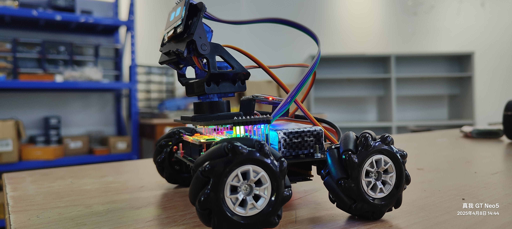
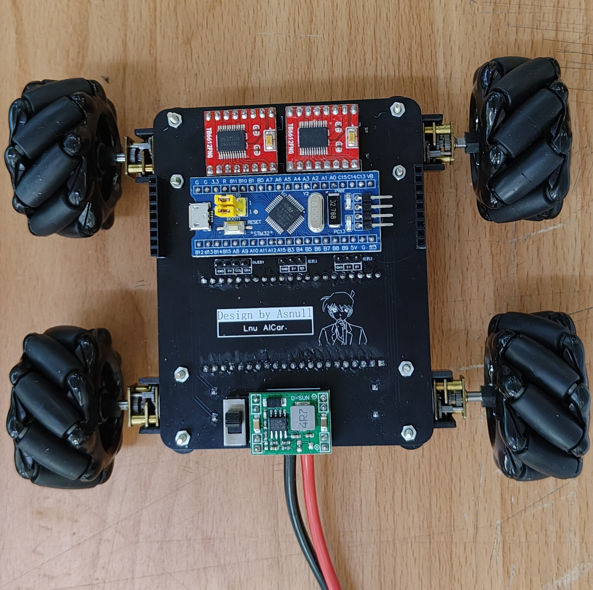

# AICar - 基于大语言模型的 Function Call 的小车控制系统

## 项目概述

AICar 是一个基于大语言模型的 Function Call 技术开发的智能小车控制系统。系统通过云端部署 AI 服务，在硬件端采用 ESP32 与 STM32 的双主控架构，实现对语音的识别和意图推理。用户通过自然语言发出指令后，云端大语言模型进行理解并生成回复，同时将回复转换为结构化的 JSON 格式动作序列，通过 ESP32 传输至 STM32 执行相应的动作。小车采用麦克纳姆轮实现全方位移动，在二自由度舵机云台搭载 OLED 屏幕实现头部效果和情绪反馈显示。





演示视频：

## 功能特点

- **自然语言控制**：通过语音指令实现对小车的自然语言控制，无需记忆特定命令
- **意图推理**：能够理解用户模糊的控制意图，生成符合预期的动作序列
- **全方位移动**：采用麦克纳姆轮设计，支持前进、后退、左右平移、旋转等全方位移动
- **头部舵机控制**：二自由度舵机云台，支持上、下、左、右等头部动作，以及点头和摇头等组合动作
- **表情显示**：在 OLED 显示屏上显示各种情绪表情，增强交互体验
- **上下文对话**：支持多轮对话记忆，根据对话上下文生成适当的动作和反馈
- **云端 AI 能力**：结合云端部署的大语言模型，实现高级语义理解和决策能力

## 系统架构

系统采用三层分布式架构设计：

1. **执行控制中心 (STM32)**：负责驱动硬件执行具体动作

   - 控制电机、舵机、OLED 显示等硬件
   - 解析并执行 JSON 格式的动作序列

2. **数据控制中心 (ESP32)**：负责数据处理与网络通信

   - 音频采集与处理（麦克风输入）
   - 音频播放（语音回复）
   - WiFi 网络连接与云端通信
   - 与 STM32 的串口通信

3. **云端服务**：提供 AI 能力支持
   - ASR (自动语音识别) 服务
   - LLM (大语言模型) 服务
   - TTS (文本转语音) 服务


## 硬件组成

- **主控单元**：
  - STM32F103C8T6 (执行控制)
  - ESP32-S3-N16R8 (数据控制与网络连接)
- **运动系统**：
  - 4 个 N20 减速电机
  - 2 个 TB6612FNG 电机驱动模块
  - 麦克纳姆轮 (全向轮)
- **交互系统**：
  - 二自由度 SG90 舵机云台
  - 0.96 寸 OLED 显示屏 (I2C 接口)
  - INMP441 全向麦克风
  - MAX98357 音频放大器与扬声器
- **电源系统**：
  - MP1584 降压模块 (7.4V 转 5V)
  - 锂电池供电

## 硬件连接

- **OLED 显示屏**：I2C 接口，连接到 PB8 (SCL) 和 PB9 (SDA)
- **舵机控制**：使用 PWM 控制，连接到指定 PWM 输出引脚
- **电机控制**：
  - 左侧电机 1：PA4、PA5 (方向控制) + PWM
  - 左侧电机 2：PA6、PA7 (方向控制) + PWM
  - 右侧电机 1：PA8、PA9 (方向控制) + PWM
  - 右侧电机 2：PB6、PB7 (方向控制) + PWM
- **串口通信**：USART3，PB10 (TX) 和 PB11 (RX)
- **音频系统**：通过 I2S 总线与 ESP32 连接

## 软件设计

### 执行控制中心 (STM32)

- 开发环境：Keil MDK 5
- 开发语言：C 语言 (标准库)
- 主要功能：解析 JSON 指令、执行动作序列、控制硬件设备

#### 执行控制中心代码结构

```
├── User/                # 用户主程序
│   ├── main.c           # 主程序入口和 JSON 解析
│   ├── main.h           # 主程序头文件
│   ├── stm32f10x_conf.h # STM32 配置文件
│   ├── stm32f10x_it.c   # 中断处理程序
│   └── stm32f10x_it.h   # 中断处理头文件
├── Hardware/            # 硬件驱动
│   ├── actions.c        # 动作执行函数
│   ├── Motor.c          # 电机控制函数
│   ├── Motor_PWM.c      # 电机 PWM 控制
│   ├── Servo.c          # 舵机控制函数
│   ├── Servo_PWM.c      # 舵机 PWM 控制
│   ├── Serial.c         # 串口通信
│   ├── OLED.c           # OLED 显示屏驱动
│   └── OLED_Data.c      # OLED 显示数据
├── System/              # 系统相关文件
└── Library/             # STM32 标准库
```

#### JSON 解析实现

STM32 通过 USART3 接收 ESP32 传来的 JSON 格式指令。main.c 中的核心代码负责解析 JSON 数据（内存限制缘故。不太适合直接使用 cjson）：

```c
// 字符串查找和解析
char *actionsStart = strstr(jsonStr, "\"actions\":[");
if (actionsStart) {
    actionsStart += 11; // 跳过"actions":[

    // 遍历actions数组中的每个元素
    char *currentPos = actionsStart;
    while (*currentPos && *currentPos != ']') {
        // 跳过空白字符和逗号
        while (*currentPos && (*currentPos == ' ' || *currentPos == ',' ||
               *currentPos == '\r' || *currentPos == '\n')) {
            currentPos++;
        }

        // 查找字符串并执行相应动作
        if (*currentPos == '\"') {
            char *actionStart = currentPos + 1;
            char *actionEnd = strchr(actionStart, '\"');

            if (actionEnd) {
                // 提取动作字符串
                char actionStr[64] = {0};
                int len = actionEnd - actionStart;
                strncpy(actionStr, actionStart, len);
                actionStr[len] = '\0';

                // 执行动作
                Serial_SendString(actionStr);
                beginActions(actionStr);

                currentPos = actionEnd + 1;
            }
        } else {
            currentPos++;
        }
    }
}
```

#### 动作执行系统

动作执行逻辑在 Hardware/actions.c 中实现，采用模块化设计，分为表情控制、运动控制和头部控制三大类：

```c
void beginActions(char *actions) {
    // 表情匹配
    faceMacth(actions);
    // 小车运动匹配
    carMoveMatch(actions);
    // 头部动作匹配
    headActionsMatch(actions);
    // 延时处理
    if (strncmp(actions, "delay,", 6) == 0) {
        int delay_ms = atoi(actions + 6); // 解析延时毫秒数
        Delay_ms(delay_ms); // 调用延时函数
    }
}
```

#### 电机控制系统

电机控制系统使用 TB6612FNG 驱动模块，支持 4 路电机独立控制，通过 PWM 控制速度，通过 GPIO 控制方向：

1. **基本运动函数**：

   - `MotorForward()` - 小车前进
   - `MotorBackward()` - 小车后退
   - `MotorStop()` - 小车停止

2. **全方位运动函数**：
   - `MotorMoveLeft()` - 左平移
   - `MotorMoveRight()` - 右平移
   - `MotorRotateLeft()` - 左旋转
   - `MotorRotateRight()` - 右旋转
   - `MotorMoveLeftForward()` - 左前方移动
   - `MotorMoveRightForward()` - 右前方移动
   - `MotorMoveLeftBackward()` - 左后方移动
   - `MotorMoveRightBackward()` - 右后方移动

实现示例（以左侧电机为例）：

```c
void MotorLeft1(int speed, char *type) {
    if (strcmp(type, "forward") == 0) {
        GPIO_SetBits(GPIOA, GPIO_Pin_5);
        GPIO_ResetBits(GPIOA, GPIO_Pin_4);
        Motor_PWM_SetCompare1(speed);
    } else if (strcmp(type, "backward") == 0) {
        GPIO_SetBits(GPIOA, GPIO_Pin_4);
        GPIO_ResetBits(GPIOA, GPIO_Pin_5);
        Motor_PWM_SetCompare1(speed);
    }
}
```

#### 舵机控制系统

头部舵机控制使用 SG90 微型舵机，通过 PWM 控制角度，支持两个自由度（水平和垂直）：

1. **基本头部函数**：

   - `headLeft()` - 头部左转
   - `headRight()` - 头部右转
   - `headUp()` - 头部上抬
   - `headDown()` - 头部下垂
   - `headCenter()` - 头部居中

2. **组合动作函数**：
   - `headNod()` - 点头动作
   - `headShake()` - 摇头动作

舵机控制实现：

```c
void Servo1_SetAngle(float Angle) {
    // 将角度转换为PWM值：0-180度映射到500-2500μs
    Servo_PWM_SetCompare3(Angle / 180 * 2000 + 500);
}

void headLeft(void) {
    Servo1_SetAngle(30);  // 水平舵机转到30度位置
}

void headRight(void) {
    Servo1_SetAngle(120); // 水平舵机转到120度位置
}
```

#### OLED 显示系统

OLED 显示系统通过 I2C 接口控制 0.96 寸显示屏，用于显示表情状态：

1. **表情函数**：
   - `blankFace` - 空白表情
   - `bigEyesFace` - 大眼睛表情
   - `happyFace` - 高兴表情
   - `sadFace` - 悲伤表情
   - 等多种情绪表情

表情显示实现：

```c
void faceMacth(char *actions) {
    if (strcmp(actions, "blankFace") == 0) {
        OLED_ShowImage(0, 0, 128, 64, blankFace);
        OLED_Update();
    } else if (strcmp(actions, "bigEyesFace") == 0) {
        OLED_ShowImage(0, 0, 128, 64, bigEyesFace);
        OLED_Update();
    }
    // 其他表情判断...
}
```

#### 串口通信系统

STM32 通过 USART3 接收来自 ESP32 的控制指令，波特率设置为 9600：

```c
void Serial_Init(void) {
    // USART3 初始化配置
    USART_InitTypeDef USART_InitStructure;
    USART_InitStructure.USART_BaudRate = 9600;
    USART_InitStructure.USART_HardwareFlowControl = USART_HardwareFlowControl_None;
    USART_InitStructure.USART_Mode = USART_Mode_Tx | USART_Mode_Rx;
    USART_InitStructure.USART_Parity = USART_Parity_No;
    USART_InitStructure.USART_StopBits = USART_StopBits_1;
    USART_InitStructure.USART_WordLength = USART_WordLength_8b;
    USART_Init(USART3, &USART_InitStructure);

    // 使能接收中断
    USART_ITConfig(USART3, USART_IT_RXNE, ENABLE);

    // 中断优先级配置
    NVIC_InitTypeDef NVIC_InitStructure;
    NVIC_InitStructure.NVIC_IRQChannel = USART3_IRQn;
    NVIC_InitStructure.NVIC_IRQChannelPreemptionPriority = 1;
    NVIC_InitStructure.NVIC_IRQChannelSubPriority = 1;
    NVIC_InitStructure.NVIC_IRQChannelCmd = ENABLE;
    NVIC_Init(&NVIC_InitStructure);

    USART_Cmd(USART3, ENABLE);
}
```

接收中断处理采用状态机方式实现，以 '@' 作为包起始标志，'\r\n' 作为包结束标志。

### 数据控制中心 (ESP32)

- 开发环境：PlatformIO (VS Code)
- 开发框架：Arduino
- 多任务模式：FreeRTOS 实时操作系统
- 主要任务：
  - AI 处理任务 (最高优先级)
  - 串口监听任务
  - WS2812 灯带控制任务

### 云端服务

- 开发语言：JavaScript (Node.js)
- 主要服务：
  - 语音识别 (ASR)
  - 大语言模型 (LLM)
  - 语音合成 (TTS)
- 通信协议：WebSocket (实时双向通信)

## JSON 指令格式

系统使用 JSON 格式传递控制指令，格式如下：

```json
{
  "response": "回复文本",
  "actions": ["动作1", "动作2", "delay,1000", "动作3", ...]
}
```

其中：

- `response` 字段为大语言模型生成的文本回复
- `actions` 字段为动作序列指令

## 支持的动作指令

### 表情显示

- blankFace：空白表情
- bigEyesFace：大眼睛表情
- astonishmentFace：惊讶表情
- happyFace：高兴表情
- trappedFace：困惑表情
- sadFace：悲伤表情
- angryFace：愤怒表情
- boredFace：无聊表情
- loveFace：喜爱表情
- questionFace：疑问表情

### 小车运动

- forward：前进
- backward：后退
- stop：停止
- moveLeft：左平移
- moveRight：右平移
- rotateLeft：左旋转
- rotateRight：右旋转
- moveLeftForward：左前方移动
- moveRightForward：右前方移动
- moveLeftBackward：左后方移动
- moveRightBackward：右后方移动

### 头部动作

- headLeft：头部左转
- headRight：头部右转
- headUp：头部上抬
- headDown：头部下垂
- headCenter：头部居中
- headNod：点头动作
- headShake：摇头动作

### 延时指令

- delay,时间：延时指定的毫秒数，如 `delay,1000` 表示延时 1 秒

## 使用方法

### STM32 部分

1. 使用 Keil MDK 打开 Project.uvprojx 项目文件
2. 编译并下载程序到 STM32 微控制器

### ESP32 部分

1. 使用 VS Code + PlatformIO 打开 ESP32 项目
2. 配置 WiFi 连接参数和云端服务器地址
3. 编译并下载程序到 ESP32

### 云端服务部分

1. 在服务器上部署 Node.js 环境
2. 安装必要的依赖包
3. 配置 ASR、LLM 和 TTS 服务的 API 密钥
4. 启动服务器程序

### 使用流程

1. 开启小车电源，等待 ESP32 连接到 WiFi
2. 通过唤醒词 "小明同学" 激活小车
3. 对小车说出指令，如 "向前走五秒然后停下来"
4. 小车会通过语音回复并执行相应的动作序列

## 示例指令与响应

**用户语音输入**：

```
你能向左旋转2秒钟，然后向右前方平移吗？
```

**大语言模型生成的 JSON 响应**：

```json
{
  "response": "好嘞，我这就开始向左旋转一会儿，然后再向右前方平移啦！",
  "actions": [
    "bigEyesFace",
    "headUp",
    "delay,1000",
    "headCenter",
    "headRight",
    "delay,1000",
    "headCenter",
    "headLeft",
    "delay,1000",
    "headCenter",
    "headDown",
    "delay,1000",
    "headCenter",
    "headNod",
    "delay,1000",
    "headCenter",
    "headShake",
    "delay,1000",
    "headCenter",
    "rotateLeft",
    "delay,2000",
    "moveRightForward",
    "delay,2000",
    "blankFace",
    "stop"
  ]
}
```

## 注意事项

- 使用前请确保硬件连接正确
- ESP32 需要连接到稳定的 WiFi 网络
- 串口波特率设置为 9600
- 云服务器需要有公网 IP 或域名，以便 ESP32 连接
- 麦克风和音箱需要适当调整位置，避免声音回授
- 电池电量低时会影响小车运行稳定性

## 项目创新点

1. 使用大语言模型的 Function Call 技术实现自然语言控制
2. 设计了基于 JSON 格式的结构化控制命令
3. 采用双控制中心 (STM32+ESP32) 和云端三级架构
4. 实现了基于对话和上下文的情绪反馈和动作自主编排
5. 设计了多层次提示词策略，增强交互的自然度和亲和力
